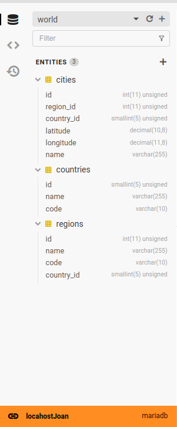

Claro, aquí tienes el texto traducido al español en formato Markdown:

```markdown
# WorldGeoDB

## Guía de Uso y Descripción de la Tabla de Datos Demográficos
Bienvenidos a la demostración de Datos Demográficos Este proyecto ofrece una colección de datos demográficos que pueden ser altamente útiles en una variedad de aplicaciones y proyectos. Esta guía te ayudará a comprender cómo utilizar eficazmente estos datos.

## Descripción de la Tabla
A continuación, se muestran las tablas disponibles en la base de datos junto con sus respectivos campos:

- Tabla de Países: Esta tabla almacena información sobre países de todo el mundo, incluyendo su nombre y código único.

- Tabla de Estados: Aquí encontrarás estados o provincias de varios países, junto con sus nombres y códigos correspondientes.

- Tabla de Ciudades: Esta tabla contiene datos sobre ciudades, incluyendo sus nombres, longitud, latitud y referencias a los estados a los que pertenecen.

## Uso de los Datos
Los datos demográficos proporcionados en este proyecto son una herramienta valiosa para una amplia gama de aplicaciones y proyectos. Algunos ejemplos de su uso incluyen:

- Desarrollo de aplicaciones y servicios basados en ubicación, así como análisis geográfico.
- Análisis de mercado y segmentación de clientes.
- Planificación urbana y toma de decisiones relacionadas con el desarrollo sostenible.

## Muestra de Datos
A continuación, se muestra una muestra de los datos disponibles en cada tabla de la base de datos. Esto te dará una clara idea de la estructura y los valores presentes en los conjuntos de datos.



Explora y aprovecha al máximo estos datos demográficos en tus proyectos!

# Descarga el SQL
https://drive.google.com/drive/folders/1nPJYKxTevytGVOks8abc2NqqwHzQ6PiQ?usp=drive_link
```

Este bloque de código Markdown incluye el texto traducido al español, listas, enlaces y una imagen. Puedes copiar y pegar este código en un archivo Markdown (.md) para visualizarlo correctamente.

Citations:
